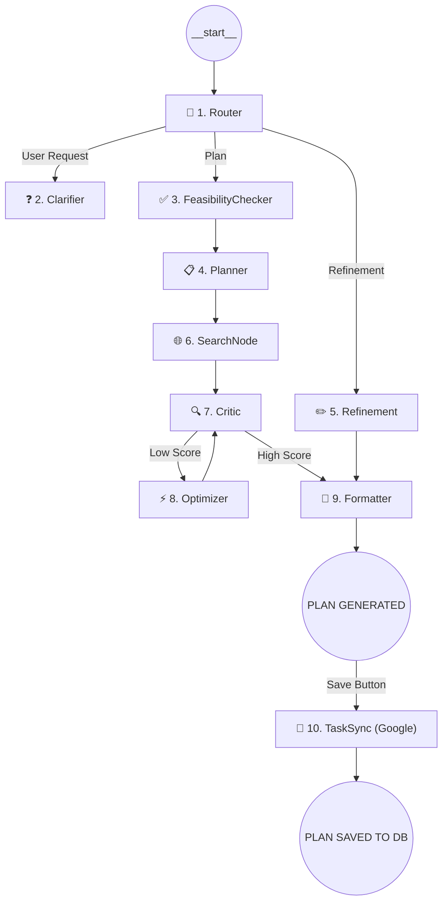

# System Overview: Goal Planning Agent (LangGraph)

This document explains the technical architecture, data flow, and inner workings of the **Goal Planning Agent** — a professional, multi-node AI system built on **LangGraph**.

## 🏗️ High-Level Architecture

The system is designed as a **cyclic Directed Acyclic Graph (DAG)**. Unlike linear LLM chains, this agent can route decisions, perform external research, critique its own work, and apply iterative improvements based on user feedback.

### The Graph Flow

---

## 🧩 Node Breakdown

The backend is modularized into specialized nodes located in `agent/nodes/`.

### 1. 🔀 Router (`router.py`)
The "Brain" of the entry point. It uses an LLM to analyze the user's intent:
- **Clarify**: If the goal is too broad to plan (e.g., "I want to be rich").
- **Plan**: If it has enough context (target + timeline).
- **Refinement**: If the user is asking for changes to an existing plan (e.g., "Make it more beginner-friendly").

### 2. ❓ Clarifier (`clarifier.py`)
Generates high-impact questions with pre-defined options to narrow down the user's requirements.

### 3. ✅ FeasibilityChecker (`feasibility_checker.py`)
Analyzes goal realism against timelines before planning. Prevents "hallucinated" or impossible roadmaps by scoring feasibility (0-100).

### 4. 📋 Planner (`planner.py`)
The core architect. Determines Temporal Scale (Weeks/Months) and generates the structured roadmap.

### 5. ✏️ Refinement (`refinement.py`)
Handles Human-in-the-Loop modifications via conversational prompts to adjust existing plans.

### 6. 🌐 SearchNode (`search.py`)
Connects the agent to the live internet using **DuckDuckGo Search** to find real-world events and resources.

### 7. 🔍 Critic (`critic.py`)
Acts as a quality gate. It scores the plan (0-10) and sends it back for optimization if it fails to meet the 8/10 threshold.

### 8. 📐 Formatter (`formatter.py`)
Ensures the final JSON is sanitized, standardized, and ready for the frontend dashboard.

### 10. 🤖 TaskSyncNode (`task_sync.py`)
Triggered on "Save." Automatically pushes plan topics to **Google Tasks**, mapping internal task states to external IDs for persistence.

---

## 💾 State Management (`state.py`)

Every node shares a global `AgentState` object (TypedDict):
| Field | Purpose |
|---|---|
| `goal` | The primary objective. |
| `plan` | The current structured roadmap JSON. |
| `events`| Real-time internet opportunities discovered via Search. |
| `google_task_ids`| Link between internal roadmap and Google Tasks. |
| `timeline_unit`| "Week", "Month", or "Year" scale. |

---

## 💾 Persistence & Data Layer (`db.py`)

The system uses a lightweight **SQLite** backend to ensure user data is not lost between sessions.
- **Persistent Plans**: All generated roadmaps can be "Saved" to the centralized database (`plans.db`).
- **Task Tracking**: Stores the completion status of every individual topic, identifying them by unique `pi_ti` (PeriodIndex_TaskIndex) IDs.
- **Relational Integrity**: Plans are assigned unique UUIDs and timestamps for versioning.

---

## 📊 Plan Tracker & Interactive Dashboard

The **Tracker View** converts a static roadmap into an active project management tool:
- **Checkbox Feedback**: Striking through completed tasks triggers an instant database update (auto-save).
- **Progress Analytics**: A dynamic progress bar provides real-time insights into completion percentage.
- **Resource Repository**: Displays curated resources for every topic discovered during the planning phase.
- **.ics Export**: Allows users to download their entire roadmap as a calendar file with a custom start date.

---

## 🛠️ Technology Stack
- **Framework**: Python 3.10+, LangGraph.
- **Database**: SQLite (built-in relational storage).
- **API**: Flask (Backend), Vanilla JS (Frontend).
- **LLM**: Azure OpenAI (GPT-4o).
- **Search**: `duckduckgo-search` (Live industry events & resources).
- **Calendaring**: iCalendar (.ics) generation for offline scheduling.
- **Google Integration**: OAuth 2.0 flow for Google Tasks synchronization.
