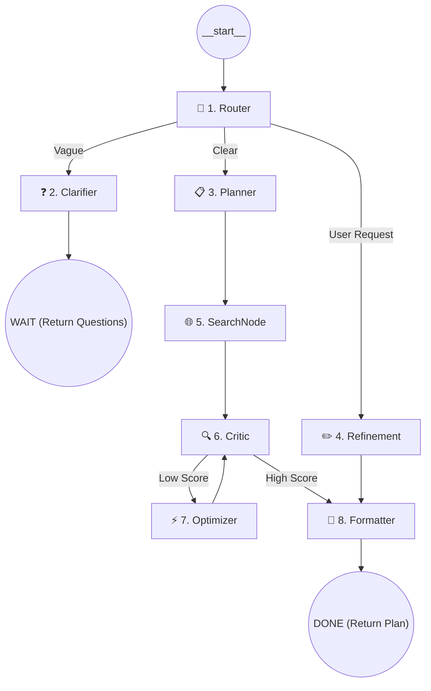

# System Overview: Goal Planning Agent (LangGraph)

This document explains the technical architecture, data flow, and inner workings of the **Goal Planning Agent** — a professional, multi-node AI system built on **LangGraph**.

## 🏗️ High-Level Architecture

The system is designed as a **cyclic Directed Acyclic Graph (DAG)**. Unlike linear LLM chains, this agent can route decisions, perform external research, critique its own work, and apply iterative improvements based on user feedback.

### The Graph Flow

---

## 🧩 Node Breakdown

The backend is modularized into 8 specialized nodes located in `agent/nodes/`.

### 1. 🔀 Router (`router.py`)
The "Brain" of the entry point. It uses an LLM to analyze the user's intent:
- **Clarify**: If the goal is too broad to plan (e.g., "I want to be rich").
- **Plan**: If it has enough context (target + timeline).
- **Refinement**: If the user is asking for changes to an existing plan (e.g., "Make it more beginner-friendly").

### 2. ❓ Clarifier (`clarifier.py`)
Generates 3-5 high-impact questions with **pre-defined options (pills)**. This minimizes user typing and ensures the agent gets the precise constraints it needs.

### 3. 📋 Planner (`planner.py`)
The core architect. It determines the **Temporal Scale** (Weeks, Months, or Years) and generates a structured JSON roadmap.
- **Context-Aware**: Integrates answers from the clarification phase.
- **Dynamic Duration**: Ensures 5-year goals don't get compressed into 10 weeks.

### 4. ✏️ Refinement (`refinement.py`)
Handles a **Human-in-the-Loop** cycle. It takes the existing plan and modifies it based on a conversational prompt from the user.

### 5. 🌐 SearchNode (`search.py`)
Connects the agent to the live internet using **DuckDuckGo Search**.
- **Real-Time Discovery**: Finds webinars, conferences, and workshops happening in 2026.
- **Fallback Logic**: If search results are sparse, it leverages internal knowledge to suggest recurring "Gold Standard" events in the industry.

### 6. 🔍 Critic (`critic.py`)
Acts as a quality gate. It scores the plan (0-10) based on specificity, resource utility, and realism. 
- **Acceptance Threshold**: Plans scoring below 8/10 are sent back for optimization.

### 7. ⚡ Optimizer (`optimizer.py`)
Rewrites sections of the plan based on the Critic's specific issues and suggestions.

### 8. 📐 Formatter (`formatter.py`)
Ensures the final JSON is sanitized, standardized, and ready for the frontend dashboard.

---

## 💾 State Management (`state.py`)

Every node shares a global `AgentState` object (TypedDict):
| Field | Purpose |
|---|---|
| `goal` | The primary objective. |
| `plan` | The current structured roadmap JSON. |
| `timeline_unit` | Tracks if we are in "Week", "Month", or "Year" mode. |
| `events`| Real-time internet opportunities found in the Search phase. |
| `critic_score` | Used for routing the optimization loop. |
| `route` | Internal state to track the active graph path. |

---

---

## 💾 Persistence & Data Layer (`db.py`)

The system uses a lightweight **SQLite** backend to ensure user data is not lost between sessions.
- **Persistent Plans**: All generated roadmaps can be "Saved" to the centralized database.
- **Task Tracking**: The application stores the completion status of every individual topic in every week/phase.
- **Relational Integrity**: Plans are assigned unique IDs and timestamps, allowing users to revisit and manage multiple goals simultaneously.

---

---

## 📊 Plan Tracker & Interactive Dashboard

The **Tracker View** converts a static roadmap into an active project management tool:
- **Checkbox Feedback**: Striking through completed tasks triggers an instant database update (auto-save).
- **Progress Analytics**: A dynamic progress bar and "Hours Done" stats provide real-time insights into the user's journey.
- **Resource Persistence**: Every individual topic resource and the global resource library are persistently saved and displayed within the tracker, ensuring the user always has the tools they need.
- **Post-Save Refinement**: Even after a plan is saved, users can chat with the AI to modify the existing roadmap (e.g., "Adjust Month 2's difficulty").

---

## 💬 Conversational Refinement (Chatbot UI)

The **Refinement Chat** has been evolved into a dedicated chatbot interface to make plan modifications natural and intuitive:
- **Speech Bubble Interface**: Distinguishes between user instructions and agent responses using a modern, floating-bubble aesthetic.
- **Integrated Action Controls**: The chat input is a consolidated "pill" box with a built-in "Send" button, providing a clear visual affordance for interaction.
- **Real-time Feedback**: The agent provides immediate conversational confirmation (e.g., "✅ Plan adjusted...") before refreshing the roadmap view.
- **Keyboard-First Workflow**: Supports the `Enter` key for instant submission, matching standard messaging software expectations.

---

## 🎨 UI & Frontend Design

Inspired by **Linear** and **Notion**, the multi-view interface is split into focused functional areas:

### 1. Tabbed Navigation
- **Plan Generator**: The "Home" for ideation, clarification, and first-draft generation.
- **My Saved Plans**: A grid of all previously created roadmaps, showing goal summaries and completion percentages.
- **Plan Tracker**: The dedicated execution view for a specific saved plan.

### 2. Layout Components
- **Top Navbar**: Global access to "New Plan", "iCal Export", and "Toggle View".
- **Sidebar (Refinement)**: A sticky panel for chat-based AI updates that persists as you navigate the roadmap.
- **Horizontal Stepper**: Visualizes the temporal phases (Weeks/Months/Years) of the goal.
- **Interactive Accordions**: Cleanly organizes topic details, duration estimates, and curated resources.

---

## 🛠️ Technology Stack
- **Framework**: Python 3.10+, LangGraph.
- **Database**: SQLite (built-in relational storage).
- **API**: Flask (Backend), Vanilla JS (Frontend).
- **LLM**: Azure OpenAI (GPT-4o) with simulation fallback for resilience.
- **Search**: `duckduckgo-search` (Live industry events & resources).
- **Integrations**: RFC 5545 (iCalendar) generation for all roadmap periods and events.
