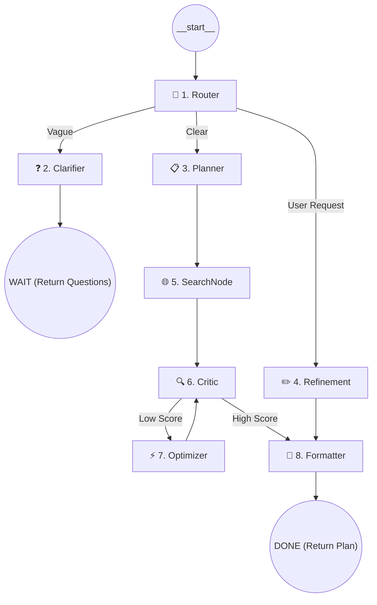

# System Overview: Goal Planning Agent (LangGraph)

This document explains the technical architecture, data flow, and inner workings of the **Goal Planning Agent** — a professional, multi-node AI system built on **LangGraph**.

## 🏗️ High-Level Architecture

The system is designed as a **cyclic Directed Acyclic Graph (DAG)**. Unlike linear LLM chains, this agent can route decisions, perform external research, critique its own work, and apply iterative improvements based on user feedback.

### The Graph Flow

---

## 🧩 Node Breakdown

The backend is modularized into 8 specialized nodes located in `agent/nodes/`.

### 1. 🔀 Router (`router.py`)
The "Brain" of the entry point. It uses an LLM to analyze the user's intent:
- **Clarify**: If the goal is too broad to plan (e.g., "I want to be rich").
- **Plan**: If it has enough context (target + timeline).
- **Refinement**: If the user is asking for changes to an existing plan (e.g., "Make it more beginner-friendly").

### 2. ❓ Clarifier (`clarifier.py`)
Generates 3-5 high-impact questions with **pre-defined options (pills)**. This minimizes user typing and ensures the agent gets the precise constraints it needs.

### 3. 📋 Planner (`planner.py`)
The core architect. It determines the **Temporal Scale** (Weeks, Months, or Years) and generates a structured JSON roadmap.
- **Context-Aware**: Integrates answers from the clarification phase.
- **Dynamic Duration**: Ensures 5-year goals don't get compressed into 10 weeks.

### 4. ✏️ Refinement (`refinement.py`)
Handles a **Human-in-the-Loop** cycle. It takes the existing plan and modifies it based on a conversational prompt from the user.

### 5. 🌐 SearchNode (`search.py`)
Connects the agent to the live internet using **DuckDuckGo Search**.
- **Real-Time Discovery**: Finds webinars, conferences, and workshops happening in 2026.
- **Fallback Logic**: If search results are sparse, it leverages internal knowledge to suggest recurring "Gold Standard" events in the industry.

### 6. 🔍 Critic (`critic.py`)
Acts as a quality gate. It scores the plan (0-10) based on specificity, resource utility, and realism. 
- **Acceptance Threshold**: Plans scoring below 8/10 are sent back for optimization.

### 7. ⚡ Optimizer (`optimizer.py`)
Rewrites sections of the plan based on the Critic's specific issues and suggestions.

### 8. 📐 Formatter (`formatter.py`)
Ensures the final JSON is sanitized, standardized, and ready for the frontend dashboard.

---

## 💾 State Management (`state.py`)

Every node shares a global `AgentState` object (TypedDict):
| Field | Purpose |
|---|---|
| `goal` | The primary objective. |
| `plan` | The current structured roadmap JSON. |
| `timeline_unit` | Tracks if we are in "Week", "Month", or "Year" mode. |
| `events`| Real-time internet opportunities found in the Search phase. |
| `critic_score` | Used for routing the optimization loop. |
| `route` | Internal state to track the active graph path. |

---

## 🎨 UI & Frontend Design

Inspired by **Notion** and **Linear**, the frontend focuses on vertical whitespace and non-intrusive elements.
- **Left Sidebar**: Permanent inputs and refinement chat.
- **Right Panel**: Scrollable roadmap with horizontal steppers and interactive accordions.
- **Opportunities Section**: An inline area that appears **only** if the Search node finds relevant events, providing a summary and "Add to Calendar" (.ics) links.

---

## 🛠️ Technology Stack
- **Framework**: Python 3.10+, LangGraph.
- **API**: Flask (Backend), Vanilla JS (Frontend).
- **LLM**: Azure OpenAI (GPT-4o) with simulation fallback.
- **Search**: `duckduckgo-search`.
- **Integrations**: RFC 5545 (iCalendar) generation for all roadmap periods and events.
