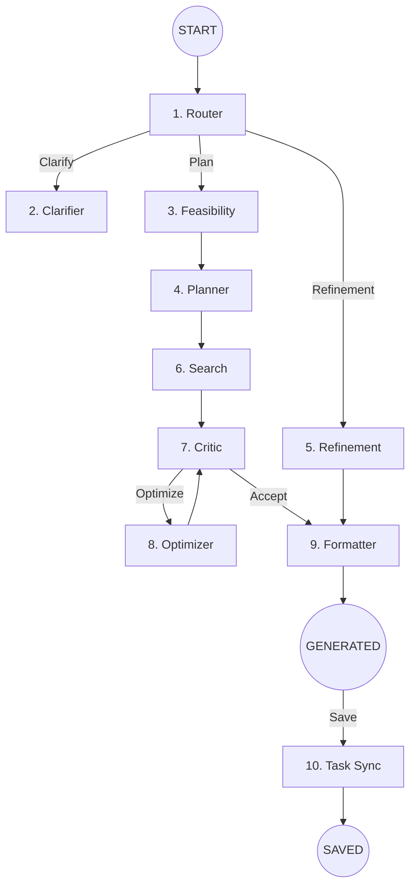

# System Overview: Goal Planning Agent (LangGraph)

This document explains the technical architecture, data flow, and inner workings of the **Goal Planning Agent** — a professional, multi-node AI system built on **LangGraph**.

## 🏗️ High-Level Architecture

The system is designed as a **cyclic Directed Acyclic Graph (DAG)**. Unlike linear LLM chains, this agent can route decisions, perform external research, critique its own work, and apply iterative improvements based on user feedback.

### The Graph Flow

---

## 🧩 Node Breakdown

The backend is modularized into specialized nodes located in `agent/nodes/`.

### 1. 🔀 Router (`router.py`)
The "Brain" of the entry point. It analyzes user intent and routes to Clarification, Planning, or Refinement based on context richness.

### 2. ❓ Clarifier (`clarifier.py`)
Generates high-impact questions with pre-defined options to narrow down ambiguous goals.

### 3. ✅ FeasibilityChecker (`feasibility_checker.py`)
Scans goal realism against timelines before planning to prevent impossible roadmaps.

### 4. 📋 Planner (`planner.py`)
The core architect that determines the temporal scale and generates the week-by-week structure.

### 5. ✏️ Refinement (`refinement.py`)
Handles Human-in-the-Loop modifications, allowing users to converse with the AI to adjust existing plans.

### 6. 🌐 SearchNode (`search.py`)
Connects the agent to **DuckDuckGo Search** to find real-world events, webinars, and resources for 2026.

### 7. 🔍 Critic (`critic.py`) & ⚡ Optimizer (`optimizer.py`)
A feedback loop that ensures plan quality. Plans scoring below 8/10 are iteratively improved until they meet professional standards.

### 10. 🤖 TaskSyncNode (`task_sync.py`)
Integrates with the **Google Tasks API** to automatically sync roadmap topics once a plan is saved.

---

## 💾 State Management (`state.py`)

Every node shares a global `AgentState` object (TypedDict):
| Field | Purpose |
|---|---|
| `goal` | The primary objective. |
| `plan` | The current structured roadmap JSON. |
| `events`| Real-time internet opportunities discovered via Search. |
| `google_task_ids`| Link between internal roadmap and Google Tasks. |
| `timeline_unit`| Scale of the plan (Week/Month/Year). |

---

## 🛡️ Security & Data Privacy

To ensure sensitive information is protected, the system implements strict local data management:
- **Secrets Management**: Files like `credentials.json`, `token.json`, and `.env` contain sensitive API keys and are explicitly ignored by version control (`.gitignore`).
- **Local Persistence**: User data is stored in a local SQLite database (`plans.db`), which is also excluded from version control to prevent unwanted data leakage.
- **OAuth 2.0**: Uses Google's secure OAuth flow to request only necessary permissions (`Google Tasks`).

---

## 📊 Interactive Dashboard

The frontend transforms static JSON plans into an active project management tool:
- **Plan Tracker**: Features auto-saving checkboxes and dynamic progress bars.
- **.ics Export**: Generates iCalendar files with custom start dates for offline scheduling.
- **Responsive UI**: A modern, glassmorphism-inspired dashboard for seamless navigation.

---

## 🛠️ Technology Stack
- **Framework**: Python 3.10+, LangGraph.
- **Frontend**: Vanilla JS, Glassmorphism CSS.
- **Database**: SQLite.
- **APIs**: Azure OpenAI (GPT-4o), Google Tasks API.
- **Search**: DuckDuckGo.
